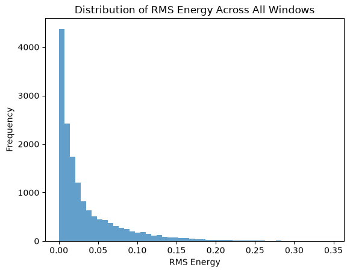
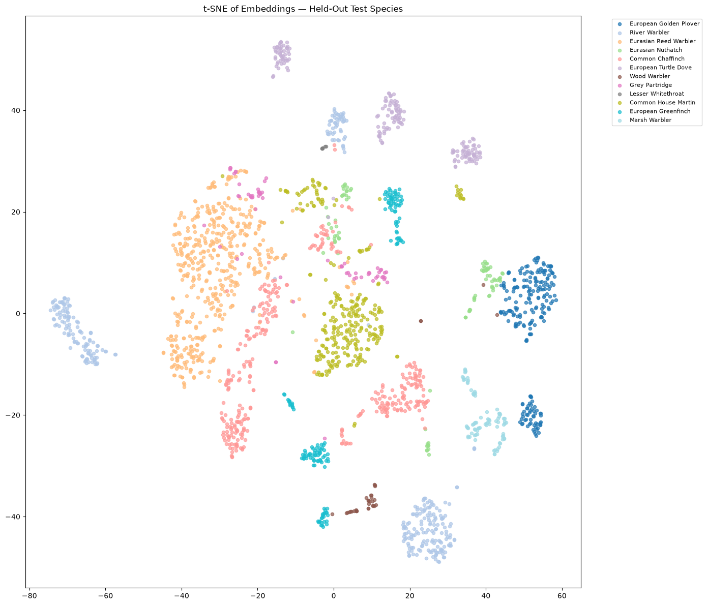

# British Birdsong Metric Learning

Uses the British Birdsong Dataset (264 recordings, 88 species, from Xeno-Canto) to train a model that learns what makes bird calls sound similar or different. Recordings of the same species should end up close together in embedding space, different species farther apart. 

## Metric learning reasoning

Each species only has 3 recordings, which is not enough to do normal classification with a real test set, so instead of training the model to output a species label, the model learns a general similarity function and gets tested on species it's never seen.

# Setup

Uses conda.

conda create -n BirdSong python=3.14
conda activate BirdSong
pip install librosa numpy pandas matplotlib seaborn torch scikit-learn scikit-image

Download the dataset from Kaggle, put it so audio files are at songs/songs/xc<file_id>.flac and metadata is at birdsong_metadata.csv.

Everything is in one notebook, birdsong_project.ipynb, plus model_5.pt for the saved model.

## What I did
Explored the metadata. 264 recordings, 88 species, exactly 3 recordings per species. Only about 120 of 264 are actually from the UK. The type field (song/call/etc.) is messy free text.
The type field mixes labels like "call, song", and there's no way to tell where a call ends and a song starts within a recording. Filtered to recordings where type mentions "song," then kept only species with at least 2 of those recordings left. Ended up with 74 species, 225 recordings. Some windows from mixed-label recordings probably come from a call, not a song — noted as a limitation, not something worth trying to fix without ground truth.
With only 3 recordings per species, normal classification doesn't work, so I went with metric learning instead, tested by holding out species entirely.
I looked at spectrograms of a few recordings. Most of a recording is silence. The bird calls in short bursts, usually under 1-2 seconds.
Tried to load the audio files and got the paths wrong twice — the dataset unzips into a nested songs/songs/ folder, and the metadata's file_id doesn't include the xc prefix or .flac extension that's actually in the filenames. Fixed by just listing the folder and looking at real filenames instead of guessing.
Wrote a windowing function that slices each recording into 1-second chunks with 50% overlap, so a handful of recordings produce a lot more training examples.
Wrote an energy filter to drop windows that are mostly silence. There's no ground truth for silence vs. call, so no threshold is "correct." Tried 0.01, 0.03, and 0.068 (from Otsu's method), and checked how many recordings each one wiped out entirely. 0.068 killed 38% of recordings. 0.01 killed under 1%. Used 0.01.
Ran into a librosa version issue checking durations — get_duration(filename=...) doesn't work anymore, it's path= now. Switched to soundfile.info() instead.
Converted the surviving windows to mel spectrograms, 128 mel bins, dB scale.
Split species into train/val/test, 70/15/15, split by species so none show up in more than one set.
Built a dataset class that samples an anchor and a positive from the same species (different recordings if possible) and a negative from a different species, sampling species uniformly so ones with more windows don't dominate.
Built a small CNN that turns one spectrogram into a 64-number embedding.
Trained with triplet loss, margin 1.0, Adam, lr=1e-3. Started at 10 epochs, then went to 40 once it was clear loss was still dropping, then 50 to allow the loss to continue dropping. At one point WINDOW_SIZE got left at 0.5 seconds from an earlier test, which caused a spectrogram shape mismatch that looked like a bug until I traced it back to the constant.
Evaluated with a one-shot test: one reference recording of a held-out species, a query from a different recording of the same species, and a distractor from a different held-out species. Correct if the query lands closer to the reference than to the distractor. First run gave a big gap between val and test (58% vs 82%). After training longer and running more trials it settled closer, 60% val vs 71% test. The test set got checked more than once during this, not just at the very end.
Made a t-SNE plot of the test-species embeddings to see the clustering.

Once epochs went up, training took close to 2 hours per run, which is why hard negative mining didn't get tested — I believe it would have taken to much time, which would not be reasonable for a project such as this.

## Results
Split	Accuracy	     Trials
Validation	60.10%	  1000
Test	70.85%	        916

Random guessing is about 50%. Both numbers are above that. The gap between them is mostly because there are only about 11 species in each split, so which species end up where matters.

## Limitations
Only 2-3 recordings per species, which caps what any method can learn here.
The energy threshold is a guess, not something checked against real labels.
About 20% of the recordings have mixed call/song labels, so some windows may not actually be song.
Only ~11 species per val/test split, so results depend a lot on which species land where.
Windowing means a lot of examples from the same species come from the same recording, so the model might be picking up on recording noise instead of species.
The test set was checked more than once during development, not just at the end.
What I'd do with more time
Use a pretrained audio embedding model instead of training a CNN from scratch. Probably the biggest lever, since the real limit here is data, not the model.
Test hard negative mining - Didn't implement do to training time constraints (2is hours for each run)
Run the split multiple times with different random seeds and report a range instead of one number.

### Pipeline diagram: audio → windowing → energy filter → spectrogram → CNN → embedding → triplet loss.

### Energy histogram Distribution

### t-SNE plot

### Training Cycle
| Epoch | Loss |
|---|---|
| 1 | 0.8193 |
| 2 | 0.6076 |
| 3 | 0.4858 |
| 4 | 0.4181 |
| 5 | 0.3499 |
| 6 | 0.3178 |
| 7 | 0.2822 |
| 8 | 0.2588 |
| 9 | 0.2450 |
| 10 | 0.2153 |
| 11 | 0.1982 |
| 12 | 0.1839 |
| 13 | 0.1816 |
| 14 | 0.1621 |
| 15 | 0.1537 |
| 16 | 0.1491 |
| 17 | 0.1351 |
| 18 | 0.1348 |
| 19 | 0.1262 |
| 20 | 0.1137 |
| 21 | 0.1132 |
| 22 | 0.1107 |
| 23 | 0.1067 |
| 24 | 0.1024 |
| 25 | 0.1016 |
| 26 | 0.0886 |
| 27 | 0.0909 |
| 28 | 0.0898 |
| 29 | 0.0922 |
| 30 | 0.0855 |
| 31 | 0.0829 |
| 32 | 0.0857 |
| 33 | 0.0751 |
| 34 | 0.0731 |
| 35 | 0.0726 |
| 36 | 0.0719 |
| 37 | 0.0686 |
| 38 | 0.0658 |
| 39 | 0.0638 |
| 40 | 0.0734 |
| 41 | 0.0664 |
| 42 | 0.0608 |
| 43 | 0.0657 |
| 44 | 0.0567 |
| 45 | 0.0557 |
| 46 | 0.0585 |
| 47 | 0.0582 |
| 48 | 0.0571 |
| 49 | 0.0522 |
| 50 | 0.0614 |

## Acknowledgments/Sources
British Birdsong Dataset — rtatman, Kaggle, sourced from Xeno-Canto
Background reading on metric learning and Siamese networks:
Triplet Loss and Online Triplet Mining in TensorFlow — Olivier Moindrot
Siamese Network & Triplet Loss: Introduction
Triplet Loss with Keras and TensorFlow — PyImageSearch
Spectral, Probabilistic, and Deep Metric Learning: Tutorial and Survey
Prototypical Networks for Few-shot Learning — Snell, Swersky, Zemel (2017)
